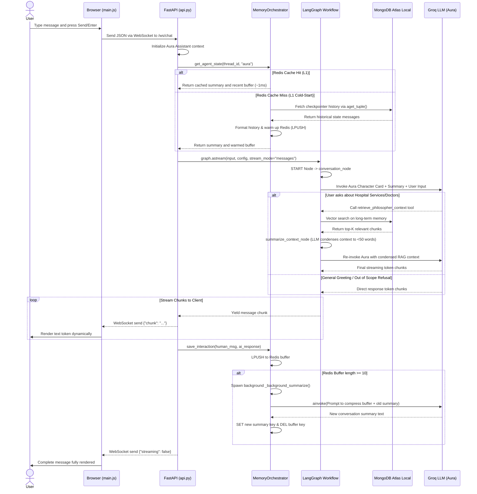

# Indus Hospital Agentic RAG Chatbot 🏥🤖

Welcome to the **Indus Hospital Agentic RAG Chatbot**, a production-grade, stateful, and real-time medical assistant platform built to serve patients and visitors of **Indus Hospital (Jaipur)**. 

The chatbot is fronted by **Aura**, the official AI medical assistant for Indus Hospital. Aura is designed to provide professional, empathetic, and highly accurate information regarding doctor schedules, specialties, facilities, contact details, and general hospital inquiries, drawing directly from official hospital web data.

---

## 1. High-Level Design (HLD)

The Indus Hospital Chatbot is engineered to deliver low-latency responses while managing complex state and external knowledge retrieval. Below are the key pillars of the design:

* **Real-Time Web Interface:** A lightweight, interactive chat widget integrated directly into the hospital's landing page ([index.html](file:///home/shobhit/Projects/philoagents-course/philoagents-ui/index.html)). Developed using vanilla JavaScript ([main.js](file:///home/shobhit/Projects/philoagents-course/philoagents-ui/src/main.js)) and custom styling ([style.css](file:///home/shobhit/Projects/philoagents-course/philoagents-ui/src/style.css)) to ensure immediate load times, micro-animations, and responsive layouts across mobile and desktop.
* **FastAPI Backend Services:** A high-performance async API layer ([api.py](file:///home/shobhit/Projects/philoagents-course/philoagents-api/src/philoagents/infrastructure/api.py)) which coordinates user sessions, handles WebSockets (`/ws/chat`) for token streaming, exposes REST fallbacks (`/chat`), and executes RAG workflows.
* **Dual-Tier Memory Architecture:**
  * **L1 Cache (Redis):** A non-blocking, in-memory cache managed by a custom [MemoryOrchestrator](file:///home/shobhit/Projects/philoagents-course/philoagents-api/src/philoagents/infrastructure/memory_orchestrator.py) that keeps the last 10 interaction pairs (sliding window) and the active summary in memory with a 24-hour Time-to-Live (TTL).
  * **L2 Persistent Store (MongoDB):** Long-term checkpointing managed through LangGraph's [AsyncMongoDBSaver](file:///home/shobhit/Projects/philoagents-course/philoagents-api/src/philoagents/infrastructure/api.py#L45-L50) to store full, permanent conversation histories.
* **Agentic RAG Core:** Orchestrated via a LangGraph [StateGraph](file:///home/shobhit/Projects/philoagents-course/philoagents-api/src/philoagents/application/conversation_service/workflow/graph.py#L21-L45). The graph dynamically routes hospital-related queries to a knowledge retriever tool and summarizes both long-term RAG context and the session history as needed.
* **Knowledge Retrieval & Embeddings:** A vector search database stored in MongoDB. Hospital pages (such as about-us, contact, doctors, bariatric-surgery, neurology, cardiology) are scraped, chunked, and embedded locally via Hugging Face sentence-transformers (`sentence-transformers/all-MiniLM-L6-v2`) using [populate_rag.py](file:///home/shobhit/Projects/philoagents-course/philoagents-api/tools/populate_rag.py).
* **LLMOps Observability:** Integrates [Opik](file:///home/shobhit/Projects/philoagents-course/philoagents-api/src/philoagents/infrastructure/opik_utils.py) for tracking execution traces, prompt versioning, and automated LLM-as-a-judge evaluations.

---

## 2. Architecture and Sequence Flow

### Memory Hierarchy and Write-Behind Caching
The orchestrator maintains user conversation state by splitting data between a high-speed L1 cache and a persistent L2 database:
1. **L1 (Redis):** Session state is saved under `session:{thread_id}:aura:buffer` (Redis List) and `session:{thread_id}:aura:summary` (Redis String).
2. **L2 (MongoDB):** LangGraph writes state checkpoints directly to `philosopher_state_checkpoints` and `philosopher_state_writes`.
3. **Write-Behind Caching:** When a message is processed, FastAPI immediately streams the tokens. Once completed, the transaction is written to Redis buffer in a non-blocking way. If the buffer hits 10 items, it triggers an async background task to summarize history, updating the Redis summary and clearing the buffer.

### System Interaction Flow
The sequence diagram below displays the interaction path when a user submits a question to Aura.

---

## 3. Issues Faced and How They Were Resolved

During the construction and tuning of this agentic chatbot, several technical hurdles were resolved:

1. **Docker Container Host Resolution (`localhost` vs `127.0.0.1` / `host.docker.internal`):**
   * *Issue:* The backend API and databases running in Docker containers could not communicate. Specifying `localhost` inside a container pointed to the container’s loopback interface instead of the host machine's open ports.
   * *Resolution:* Reconfigured the environment database connection strings ([pyproject.toml](file:///home/shobhit/Projects/philoagents-course/philoagents-api/pyproject.toml) / [config.py](file:///home/shobhit/Projects/philoagents-course/philoagents-api/src/philoagents/config.py)) to map loopbacks explicitly. Database hosts are mapped correctly to the Docker internal bridge (`host.docker.internal` or standard host bindings) to enable communication between Docker services and host components.
2. **Context Window Bloat & Inference Latency in RAG:**
   * *Issue:* Extracting long-form paragraphs from scraped hospital webpages and dumping them directly into the LLM system prompt consumed excessive tokens and slowed down the LLM response time.
   * *Resolution:* Implemented a dedicated [summarize_context_node](file:///home/shobhit/Projects/philoagents-course/philoagents-api/src/philoagents/application/conversation_service/workflow/nodes.py#L123-L135) in the LangGraph StateGraph. The node uses a faster, cheaper LLM (`llama-3.1-8b-instant`) to compress retrieved documents to under 50 words before passing them to the primary conversational LLM.
3. **Blocking Thread Performance During Summarization:**
   * *Issue:* Running conversation summarization synchronously after every message added significant latency, making the user wait up to 4 extra seconds for the UI to become interactive again.
   * *Resolution:* Created a hybrid write-behind caching system in the [MemoryOrchestrator](file:///home/shobhit/Projects/philoagents-course/philoagents-api/src/philoagents/infrastructure/memory_orchestrator.py). Summarization is executed completely out-of-band. Once a message is sent, the API returns the stream. The update to the Redis buffer triggers an `asyncio.create_task()` which generates and commits the summary in the background, keeping user latency close to zero.
4. **FastAPI Lifespan Connection Leak with LangGraph Checkpointer:**
   * *Issue:* LangGraph's `AsyncMongoDBSaver` requires active client sessions. Creating and destroying connections on every chat request resulted in connection pool exhaustion and sluggish response times.
   * *Resolution:* Managed the lifecycle of `AsyncMongoDBSaver` in the FastAPI [lifespan](file:///home/shobhit/Projects/philoagents-course/philoagents-api/src/philoagents/infrastructure/api.py#L38-L74) startup/shutdown hook. The saver is instantiated once globally and injected into endpoints using FastAPI's dependency injection (`Depends`), preventing memory and socket leaks.
5. **Prompt Injection & Character Persona Drift (Medical Disclaimer Enforcements):**
   * *Issue:* Users attempts to trick the AI into offering definitive medical diagnoses or escaping the hospital topic (e.g. asking "write a Python script").
   * *Resolution:* Structured the [Prompt](file:///home/shobhit/Projects/philoagents-course/philoagents-api/src/philoagents/domain/prompts.py) system card with **Strict Scope Restrictions** (out-of-domain queries are politely rejected) and **No Medical Diagnoses** (disclaimers advising consultation of licensed doctors are dynamically emphasized). Guardrails are evaluated using Opik test suites to guarantee strict compliance.

---

## 4. Key Concepts and Project Learnings

Developing the Indus Hospital Agentic Chatbot yielded several valuable architectural and AI engineering insights:

1. **Dual-Tier State Caching (In-Memory + Document persistence):**
   * Maintaining conversation state in real-time applications requires a separation of concerns. Serving immediate context from Redis (L1) keeps transaction times under 2ms, while backing up checkpoints in MongoDB (L2) guarantees long-term durability and cold-start security.
2. **Deterministic Agent Coordination (LangGraph):**
   * Traditional LLM chat architectures rely on linear chains. By utilizing a StateGraph, the assistant can execute cyclical routing decisions, invoke multiple retrieval tools, summarize context, and evaluate state transitions dynamically, providing a reliable agentic workflow.
3. **Information Density Control (Token Lifecycle Management):**
   * Large contexts lead to higher costs, slower speed, and lost context. Compressing retrieval context (via summarization nodes) and chat history (via sliding-window background summarization) ensures the LLM stays fast and behaves predictably.
4. **Strict System Guardrails in High-Stakes Domains:**
   * In healthcare applications, safety and compliance are paramount. Restricting the agent's pre-trained knowledge base and forcing it to answer questions *strictly* from retrieved official hospital facts (zero hallucination tolerance) is crucial to avoid misinformation.
5. **Observability and Evaluation in LLMOps:**
   * Building an agent is only half the battle. Tracing execution chains, inspecting tool arguments, and versioning prompts via tools like Opik is essential to profile latency, track costs, and verify that changes do not cause agent regression.
