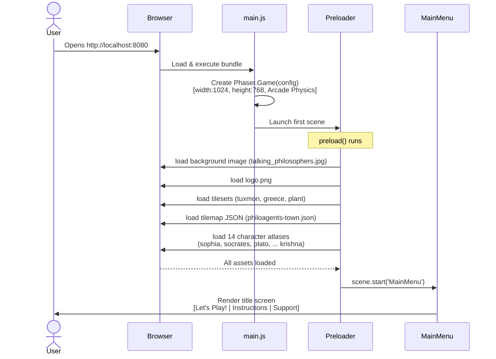
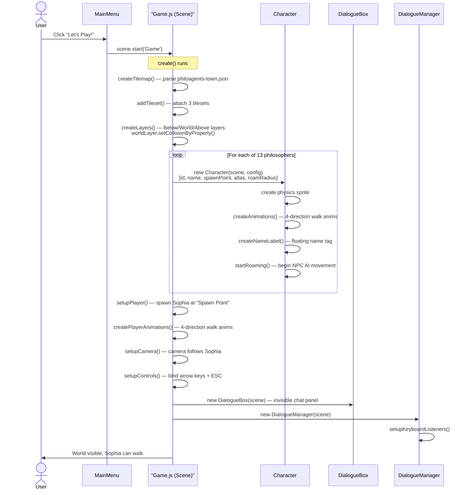
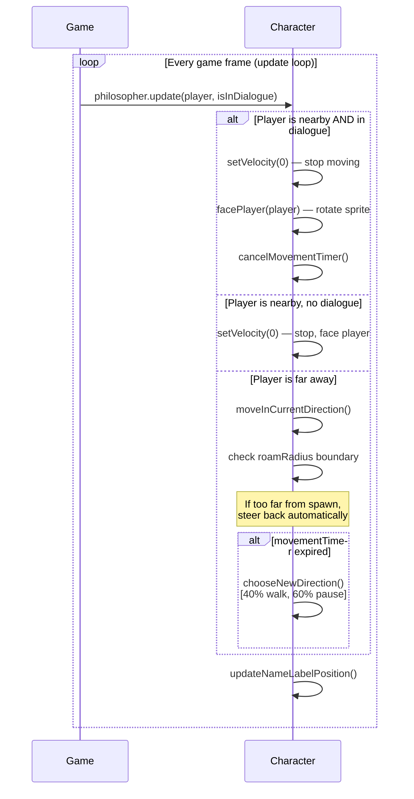
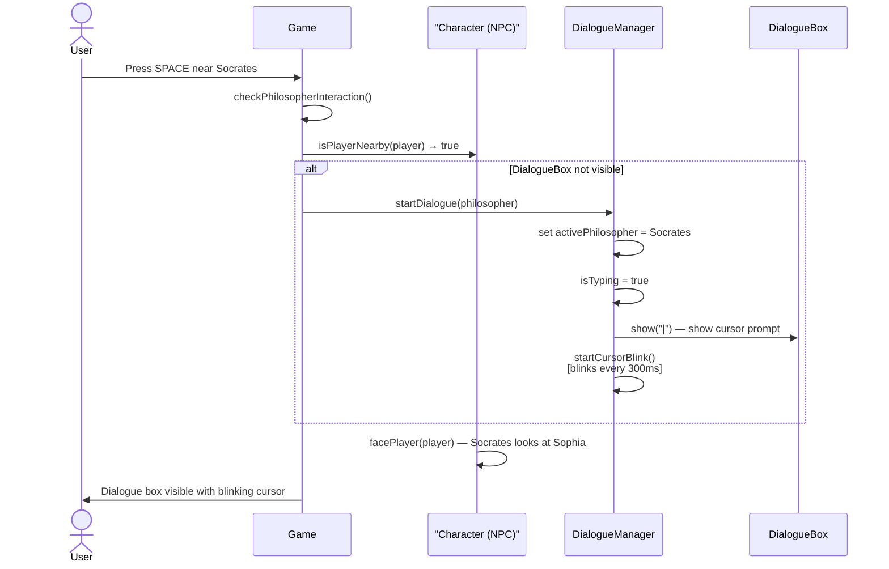
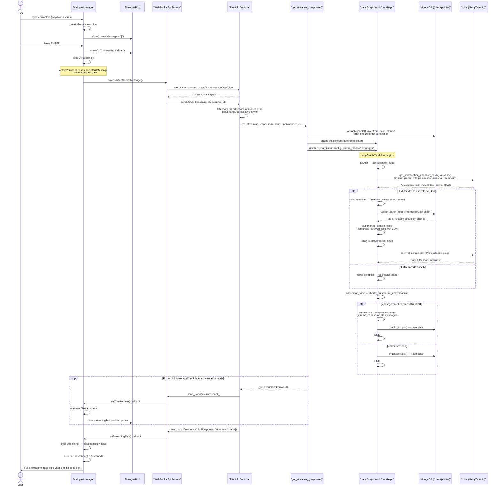
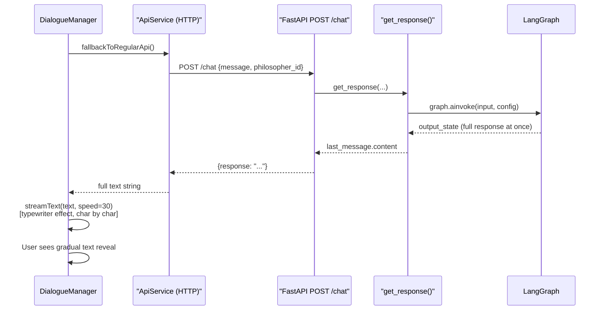
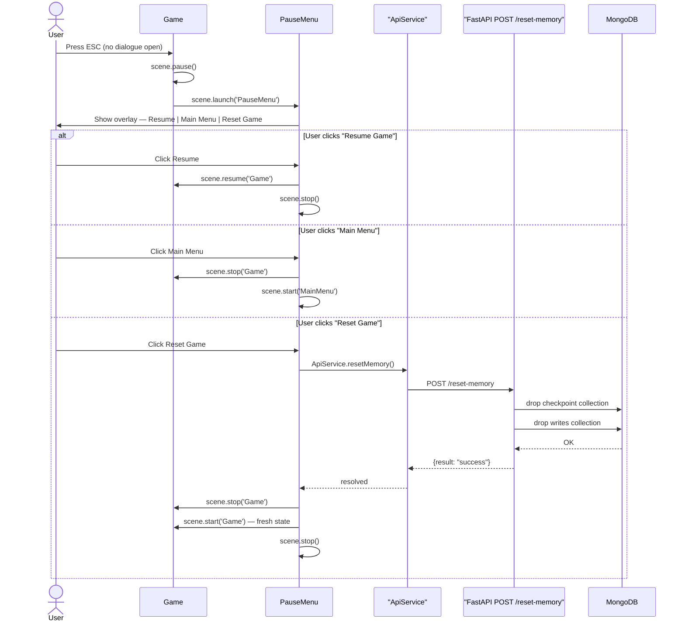
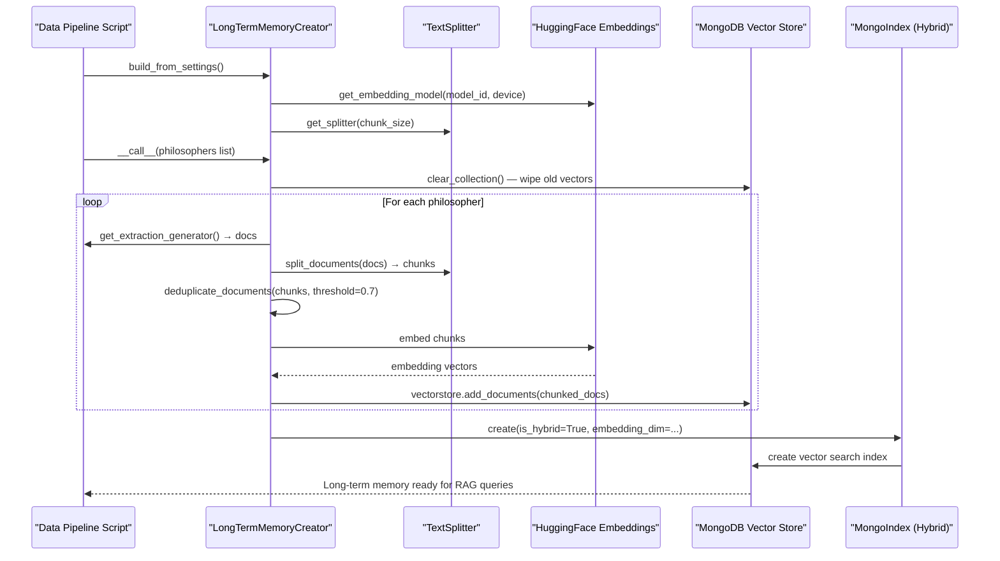

# PhiloAgents — Full System Sequence Diagram

Two main flows are documented here:
1. **Game Boot & Asset Loading** — how the UI starts up
2. **Player Conversation with a Philosopher** — the core interaction path, including the LangGraph agent pipeline

---

## Flow 1: Game Boot & Asset Loading

---

## Flow 2: Player Starts the Game

---

## Flow 3: NPC Roaming (Every Frame)

---

## Flow 4: Player Walks Up & Starts Dialogue (SPACE key)

---

## Flow 5: User Types & Sends a Message (WebSocket Path)

---

## Flow 6: Fallback Path (REST API if WebSocket fails)

---

## Flow 7: Pause Menu & Reset Game

---

## Flow 8: Long-Term Memory Population (Offline / Startup)

